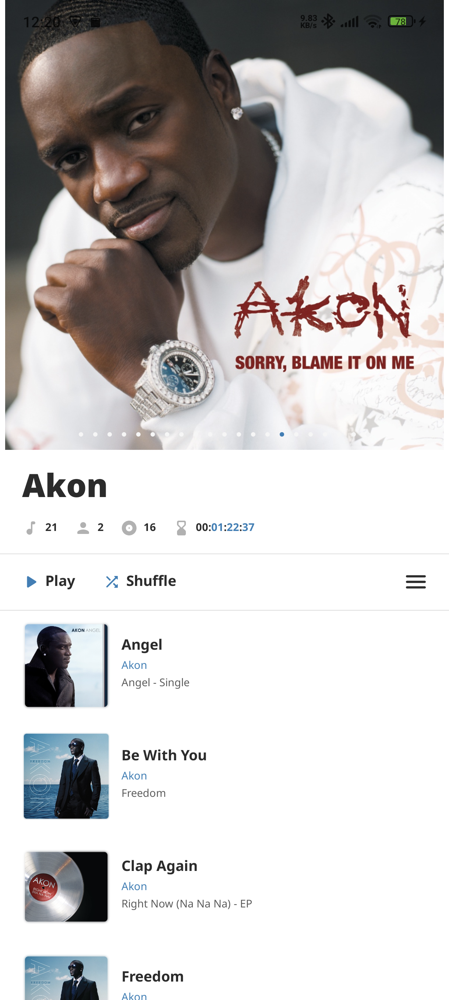

# Felicity

*_Felicity_ is the third and final app of the three project I planned for my own learning, the first
two are [Positional](https://github.com/Hamza417/Positional)
and [Inure App Manager](https://github.com/Hamza417/Inure).*

The development of the app has started and if you've used the first two apps you might wanna join
the [Telegram Channel](https://t.me/felicity_music_player) and become the part of the whole initial
development process.

## Status

(13 Jun, 2023) I've finalized second level design framework and written most of the APIs now, I still haven't found this app's design language, I'm not sure how this app will look like yet.

## Screenshots

### Initial Look of the app

#### Home Screen

#### Felicity ArtFlow

